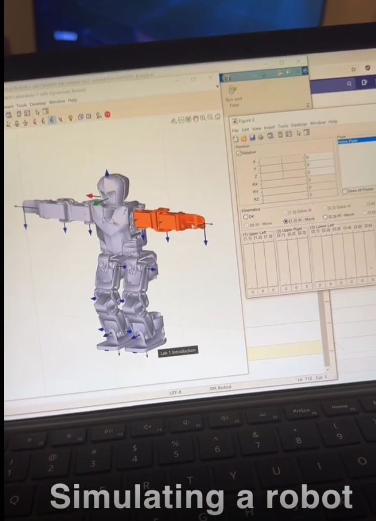

# Fundamentals of Robotics and Robotic Automation

## 🤖 Simulation Preview




## 📌 Project Overview
This repository contains the advanced engineering codebase, mathematical models, and algorithmic implementations developed for the **Monash University Robotics Unit**. The core objective of this project is to bridge theoretical robotics principles with practical, industry-standard simulation and control methodologies.

The system focuses on the end-to-end design, modelling, and trajectory planning of serial robotic manipulators used in modern manufacturing and automation environments. By leveraging **MATLAB** and specialized toolboxes, this project demonstrates rigorous analysis of multi-degree-of-freedom (DoF) systems, covering everything from rigid-body transformations to complex nonlinear control loops.

## 🛠️ Core Engineering Capabilities & ATS Keywords
* **Kinematics & Spatial Geometry:** Spatial descriptions and transformations, Denavit-Hartenberg (DH) parameters, forward kinematics (FK), and geometric/analytical inverse kinematics (IK) solver design.
* **Differential Kinematics:** Analytical and geometric Jacobian formulation, singularity analysis, and differential relationship mapping.
* **Rigid-Body Dynamics:** Formulation of equations of motion using both the energy-based **Lagrangian formula** and the recursive **Newton-Euler equations**.
* **Advanced Control Systems:** Synthesis of linear position controllers and high-performance **nonlinear motion controllers** (e.g., Computed Torque Control) paired with robust **force controllers** for interactive environments.
* **Trajectory & Task Planning:** Path planning algorithms, obstacle avoidance, joint-space vs. Cartesian-space interpolation, and automated task scheduling.
* **Industrial Automation:** End-effector configuration, workspace envelope appraisal, computational geometry for design and manufacture, and an introduction to mobile autonomous systems.

## 🎯 System Learning Outcomes Achieved
1. **Analyse Problems of Direct and Inverse Kinematics:** Implemented robust analytical and numerical algorithms to accurately resolve position and orientation state vectors for multi-DoF serial links.
2. **Generate Robotic Dynamics Models:** Established high-fidelity dynamic models utilizing **Lagrangian and Newton-Euler paradigms** to predict joint torques and inertial forces under varying payloads.
3. **Design Linear and Nonlinear Controllers:** Architectured closed-loop control strategies ensuring precise tracking, disturbance rejection, and optimal interaction force management.
4. **Design Robotic Tasks:** Synthesised complex, collision-free paths using advanced computational geometry to program automated manufacturing sequences.
5. **Appraise Serial Manipulator Performance:** Conducted comprehensive workspace optimization and dynamic performance metrics evaluations to assess structural design efficiency.

## ⚙️ Technical Environment & Dependencies
* **Software:** MATLAB (R2024a or later preferred)
* **Toolboxes Required:** 
  * Robotics System Toolbox
  * Control System Toolbox
  * Symbolic Math Toolbox (for Lagrangian derivation)
* **Languages:** MATLAB / Simulink Scripting

## 🚀 Getting Started & Execution
1. **Clone the Repository:**
   ```bash
   git clone https://github.com
   cd monash-robotics-unit
   ```
2. **Initialize the Environment:** Open MATLAB, navigate to the project directory, and run `startup.m` to add all structural subfolders to the MATLAB search path.
3. **Run Kinematics Solver:** Execute `scripts/run_kinematics.m` to compute the DH-parameter matrix and evaluate the manipulator workspace.
4. **Execute Simulink Simulation:** Open `models/manipulator_control.slx` to observe the performance differences between the linear PID and nonlinear controllers under dynamic loading conditions.

## 📐 Algorithmic Architecture
The dynamics engine calculates the localized joint torque vectors $\tau$ explicitly via the manipulator dynamic equation:

$$\tau = M(q)\ddot{q} + C(q, \dot{q})\dot{q} + G(q) + J^T(q)F_e$$

Where:
* $M(q)$ represents the symmetric, positive-definite inertia matrix.
* $C(q, \dot{q})$ denotes the Coriolis and centripetal forces matrix.
* $G(q)$ is the gravitational vector.
* $J^T(q)F_e$ maps external end-effector wrench forces back into joint space via the transpose of the geometric **Jacobian**.

## 📜 Academic Attribution
This portfolio project was developed in alignment with the curriculum specified by the Department of Mechanical and Aerospace Engineering at **Monash University**. It serves as architectural proof of concept for autonomous systems engineering, modern industrial robotics, and model-based design protocols.
